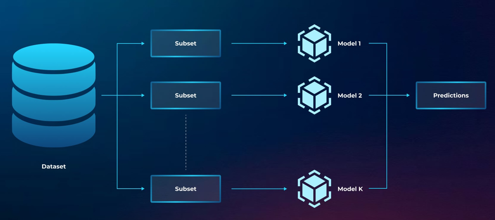

# PFSS-Ensemble-Models


## Abstract
Feature selection is a crucial step in traditional machine learning pipelines, especially for high-dimensional 
datasets where irrelevant or redundant features can degrade model performance and interpretability. 
This work introduces a novel probabilistic framework for feature subset selection that integrates with 
ensemble learning methods such as Random Forests, Gradient Boosting, and Bagging. Unlike deterministic 
feature selection techniques, which output a fixed subset of features, our approach assigns probabilities 
to features based on statistical or information-theoretic metrics such as mutual information, Gini importance, 
or variance.

Feature subsets are sampled probabilistically, and multiple ensembles are trained on these subsets, 
enabling robust feature importance evaluation. The framework quantifies uncertainty in feature importance 
by analyzing the probabilistic distributions and supports diverse datasets across domains like healthcare, 
finance, and general tabular data. Experimental results on standard datasets demonstrate improved 
generalization and interpretability, particularly for high-dimensional datasets. This method bridges the 
gap between traditional feature selection and ensemble learning, providing a scalable, interpretable, and 
effective solution for machine learning tasks.


## Installation
Before running the code, install the required packages using the following command:
```bash
pip install -r requirements.txt
```

## Usage


## Results


## References
```
1. Reference 1
2. Reference 2
3. Reference 3
```


## License
This project is licensed under the MIT License - see the [LICENSE](LICENSE) file for details.


## Contacts
